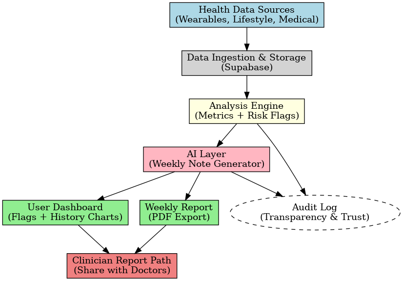

# SubHealthAI: Early Detection Before Diagnosis

SubHealthAI is an **AI-powered preventive health project currently in development**.  
Its purpose is to analyze wearable and lifestyle data to identify **early warning signals**  
and **subclinical patterns** that often go unnoticed in traditional healthcare.  
The goal is not to provide a medical diagnosis, but to **support physicians today** 
with a long-term vision of **empowering individuals under physician oversight** 
by surfacing trends that may warrant preventive attention.

---

### Why this matters
- Chronic diseases account for almost **90% of U.S. healthcare spending** ($4.1 trillion annually).  
- Many conditions begin with **silent inflammation or early dysfunctions** that existing diagnostic tools miss.  
- By offering physicians and eventually individuals a clearer view of these early risk patterns,  
SubHealthAI has the potential to lower long-term costs and improve health outcomes.  
- All development follows a **privacy-first design** and will align with **HIPAA and FDA digital health guidelines** during clinical testing.

---

## 🚀 What We’re Building (MVP)
- **Data ingestion** from wearables, lifestyle tracking, and behavioral inputs  
- **Signal flags**: rule-based indicators (e.g., sleep debt, HRV decline, elevated resting HR)  
- **AI-generated weekly note**: plain-language report summarizing risks and trends  
- **Clinician export**: one-tap PDF/email report with tables, charts, and references  
- **Audit logging**: system-wide transparency for trust and reliability  

This repository contains the **starter codebase**, database schema, and demo UI for the MVP.

---

## 🖼 Architecture

[Wearables APIs]   [Lifestyle Inputs]
        │                   │
        ▼                   ▼
     Data Ingestion (Cron jobs, ETL)
                │
                ▼
        Supabase Database
   (users, events, metrics, flags)
                │
                ▼
   Flag Computation Engine (rule-based)
                │
                ▼
   AI Layer (LLM wrappers for weekly note)
                │
                ▼
    Reports → Dashboard / PDF / Email

---

## 🛠 Tech Stack
- **Frontend**: Next.js (App Router), TailwindCSS  
- **Backend / Auth**: Supabase (Postgres, Row-Level Security, Auth)  
- **Data Processing**: Cron-style scripts for wearable delta ingestion + flag computation  
- **AI Integration**: LLM wrappers for generating weekly notes (OpenAI / Hugging Face)  
- **Export**: PDF generation + email delivery (transactional API integration planned)  

---

## 🗂 Database Schema
Key tables in `/supabase/schema.sql`:
- `users` → profiles and auth linkage  
- `events_raw` → ingested wearable + lifestyle data  
- `metrics` → computed metrics (sleep, HR, HRV, steps, etc.)  
- `flags` → rule-based signals indicating early risk  
- `weekly_notes` → AI-generated summaries for end users  
- `audit_log` → system-wide transparency and accountability  

---

## 📈 Roadmap
- [x] Project scaffold: Next.js + Supabase + TailwindCSS  
- [x] Core schema design (users, events, flags, metrics, notes, audit log)  
- [ ] Basic dashboard UI with signal flags + weekly note preview  
- [ ] PDF export and clinician-ready report  
- [ ] Integrations with wearable APIs (Fitbit, Oura, Garmin, Apple Health)  
- [ ] Advanced AI models: time-series forecasting, embeddings, and multi-modal risk scoring  
- [ ] Exploratory pilot testing with clinical advisors (pending regulatory alignment)  

---

## 📄 Whitepaper
See `/docs/whitepaper-outline.md` for the initial research framing:  
- U.S. healthcare burden of chronic illness  
- Gaps in early detection and subclinical dysfunction  
- SubHealthAI’s proposed solution architecture  
- Future research, clinical validation pathway, and regulatory considerations (HIPAA, FDA)  

---

## 🤝 How to Contribute
We welcome collaborators in:  
- Preventive medicine, public health, and clinical research  
- AI/ML modeling (time-series, embeddings, anomaly detection)  
- Full-stack engineering (Next.js, Supabase, data pipelines)  

---

## 📬 Contact
Founder: **Mohd Shaarif Khan**  
Email: **shaarifkhan12@gmail.com** 
GitHub: **https://github.com/Shaarax**  
LinkedIn: **www.linkedin.com/in/mohdshaarif-khan**  

---

> ⚠️ **Disclaimer**: SubHealthAI is a research and development project.  
> It is **not a medical device** and does not provide medical advice.  
> All future development will follow **HIPAA-compliant, privacy-first design**  
> and align with FDA digital health guidelines.  
> Always consult qualified healthcare professionals for medical decisions.
