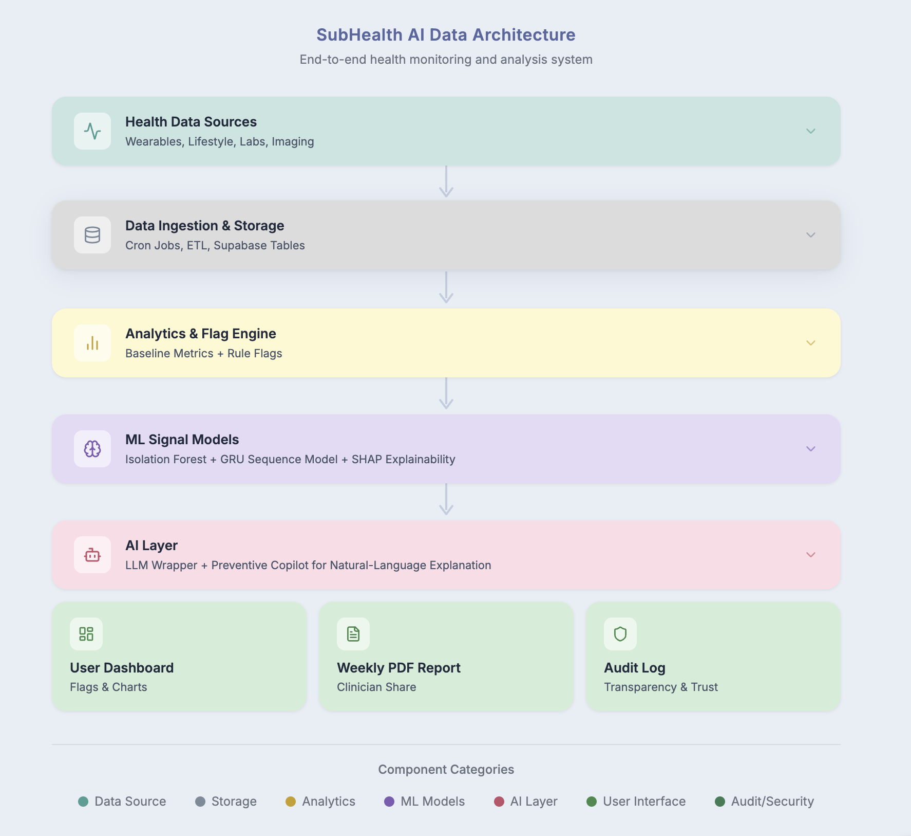

# SubHealthAI: Explainable Preventive Health Intelligence

SubHealthAI is an **AI-powered preventive health project currently in development**.  
Its purpose is to analyze wearable and lifestyle data to identify **early warning signals** and **subclinical patterns** that often go unnoticed in traditional healthcare.  
The goal is not to provide a medical diagnosis, but to **support physicians today** with a long-term vision of **empowering individuals under physician oversight** by surfacing trends that may warrant preventive attention.
The project is in active research and early validation stages following publication of its technical whitepaper on **Preprints** (DOI [10.20944/preprints202511.0156.v1](https://doi.org/10.20944/preprints202511.0156.v1)) and archival repository version on **Zenodo** (DOI: [10.5281/zenodo.17388335](https://doi.org/10.5281/zenodo.17388335)).

---

### Why this matters
- Chronic diseases account for almost **90% of U.S. healthcare spending** ($4.1 trillion annually).  
- Many chronic conditions may begin with **silent inflammation or early physiological dysfunction** that can remain unnoticed until symptoms emerge, diagnostic thresholds are crossed, or clinical escalation occurs.
- By offering physicians and eventually individuals a clearer view of these early risk patterns,  
SubHealthAI has the potential to lower long-term costs and improve health outcomes.  
- All development follows a **privacy-first design** and will align with **HIPAA and FDA digital health guidelines** during clinical testing.

---

## 🔍 What SubHealthAI Actually Does
Most wearable apps today provide raw metrics (HR, HRV, steps, sleep) in isolation.
They rarely integrate these into meaningful health patterns or long-term risk insights.

SubHealthAI is different. It provides a **structured "early warning" layer** on top of wearable and lifestyle data:

1. **Cross-signal integration**  
   - Combines multiple inputs (HRV decline, rising resting HR, accumulated sleep debt, activity instability).  
   - Surfaces dysfunction patterns that single-device apps cannot reveal.

2. **Subclinical risk flags (not diagnosis)**  
   - Generates explainable “early warning flags” such as possible inflammation risk or metabolic strain.  
   - Each flag includes supporting rationale and confidence scoring.

3. **Longitudinal tracking**  
   - Analyzes rolling 7/30/90-day trends instead of one-night snapshots.  
   - Captures slow-moving dysfunctions and reduces false positives.

4. **Multimodal roadmap**  
   - Now (MVP): wearable + lifestyle inputs.  
   - Future: optional patient-provided lab results (e.g., CRP, HbA1c, vitamin D) to increase precision.

5. **Clinician-ready outputs**  
   - Weekly plain-language notes for users.  
   - One-tap PDF/Email reports with tables, charts, and citations designed for physicians.

By sitting between raw wearable data and formal clinical diagnosis, SubHealthAI addresses a critical preventive-health gap: turning fragmented signals into structured, explainable insights that may support earlier awareness, monitoring, and follow-up.

---

## 🧩 AI & Explainability Layer (New)

SubHealthAI now includes a **machine learning and explainable AI pipeline** that enhances the preventive insights:

1. **Baseline Model (scikit-learn)**  
   - Detects daily deviations from a user’s personal baseline (HRV, Resting HR, Sleep, Steps).  
   - Uses robust z-score normalization and Isolation Forests to compute a non-diagnostic risk score.  

2. **Forecast Model (PyTorch)**  
   - Learns time-series trends to forecast next-day risk changes.  
   - Helps visualize improvement or deterioration before symptoms appear.  

3. **Explainability (SHAP + Linear Surrogates)**  
   - Generates feature importance visuals showing *why* the AI highlighted a risk.  
   - Each explanation translates into plain English on the dashboard via the **“Why this score?”** modal.  
   - Lawyers, clinicians, or reviewers can easily interpret risk factors without technical background.

4. **Risk Scores Table (Supabase)**  
   - Stores daily risk outputs with version tracking and full audit logs.  
   - Includes rationale, z-scores, and disclaimers to ensure transparency and compliance.  

---

## 🚀 What We’re Building (MVP)
- **Data ingestion** from wearables, lifestyle tracking, and behavioral inputs  
- **Signal flags**: rule-based indicators (e.g., sleep debt, HRV decline, elevated resting HR)  
- **AI-generated weekly note**: plain-language report summarizing risks and trends  
- **Clinician export**: one-tap PDF/email report with tables, charts, and references  
- **Audit logging**: system-wide transparency for trust and reliability  

This repository contains the **starter codebase**, database schema, and demo UI for the MVP.

---

## 🩺 User-Friendly Dashboard (Explainable UI)

The new dashboard focuses on **clarity for clinicians, reviewers, and regulators**:

- **Interactive Risk Card:** Displays current risk % with color-coded badge (green, yellow, red).  
- **Sparkline Chart:** Visualizes the risk trend over time.  
- **Explainability Modal (“Why this score?”):**  
  - Lists plain-language reasons (e.g., “Resting Heart Rate higher than baseline — contributes to higher risk”).  
  - Includes AI-generated visual (SHAP plot or fallback bar chart).  
  - Adds a clear, non-diagnostic disclaimer.  

All text is structured for **regulatory readability**, ensuring transparency and comprehension for  
attorneys, clinicians, and adjudicators reviewing preventive AI systems.

---

## 🖼 Architecture



```text
[Wearable APIs]       [Lifestyle Inputs]       [Lab / Imaging Data*]
      │                      │                         │
      └──────────────┬────────┴──────────────┬──────────┘
                     ▼
           Data Ingestion Layer
           (Cron Jobs, ETL, API Sync)
                     │
                     ▼
            Supabase Database
     (users, metrics, flags, risk_scores,
      explainability_images, audit_log)
                     │
                     ▼
        Health Analytics & Flag Engine
      (Rule-based flags + Metric baseline)
                     │
                     ▼
      ML Risk Models (Isolation Forest,
          GRU Forecast, SHAP Explainability)
                     │
                     ▼
     AI Layer (LLM Wrapper + Preventive Copilot)
      - Generates Weekly Notes
      - Explains Risk Trends
      - Conversational Interpretation
                     │
                     ▼
         Reports & Visualization Outputs
      → User Dashboard (Next.js)
      → Clinician PDF / Email Report
      → Audit Log for Transparency
```

This diagram illustrates SubHealthAI’s end-to-end data flow, showing how wearable and lifestyle metrics are ingested, processed, and transformed into explainable, auditable risk insights.


*End-to-end data flow with explainability and audit compliance.*

---

You can test SubHealthAI locally in 60 seconds:

1. Start the dev server:
   ```bash
   npm run dev
   ```
2. Open http://localhost:3000/ingest
3. Upload the sample file docs/sample.csv
4. Visit http://localhost:3000/dashboard → metrics & charts update.
5. Click Run Daily Cron (Demo) → flags + weekly note generated.
6. Open http://localhost:3000/weekly → weekly summary.
7. Download PDF from http://localhost:3000/api/report 

⚠️ Demo only - no PHI, not a medical device.

---

## 🛠 Tech Stack
**Frontend (App Layer)**  
- Next.js (App Router), React, TypeScript  
- TailwindCSS + shadcn/ui for responsive, clinician-friendly UI
- Risk dashboard with sparkline + “Why this score?” modal (`risk-panel.tsx`, `ExplainModal.tsx`, `RiskSpark.tsx`)  
- API endpoints:  
  - `/api/risk/explain` → human-readable reasoning + disclaimer  
  - `/api/report` → clinician PDF including AI risk summary

**Backend & Database**  
- Supabase (Postgres with Row-Level Security, Auth, Storage)  
- Supabase Edge Functions (Deno/TypeScript) for ingestion and daily rollups  
- Python Worker for analytics and ML pipelines (decoupled from web app)  

**Data Processing & Analytics**  
- Ingestion: wearable APIs, lifestyle logs, CSV imports  
- Baseline deviation analysis (sleep, HR, HRV, steps)  
- Hybrid rules + ML scoring engine (Python):  
  - scikit-learn → anomaly detection, clustering, baseline modeling  
  - PyTorch → time-series forecasting and risk scoring

  - **Explainable ML models (Python / Supabase Integration):**
  - `/ml/baseline_model.py` → anomaly detection and personalized baseline risk  
  - `/ml/forecast_model.py` → time-series forecasting of risk changes  
  - `/ml/explainability.py` → SHAP visualizations and linear surrogate fallback  
  - Outputs written to `risk_scores` table (auditable, versioned)
  

**AI & NLP Integration**  
- LLMs assisted narrative generation for plain-language weekly notes  
- Schema-enforced outputs with disclaimers and rationales stored in audit logs  
- Compliance guardrails: prevent diagnostic claims, enforce structured reporting  

**Reporting & Export**  
- react-pdf / pdf-lib for clinician-ready exports  
- Transactional email delivery (Postmark, SendGrid, Supabase Functions)  

**Security & Compliance**  
- Row-Level Security on all user data  
- Audit logging of all automated actions (`audit_log` table)  
- HIPAA/FDA alignment by design (encryption, disclaimers, transparency)  

---

## 🤖 ML Model Integration (FastAPI + Next.js)

SubHealthAI includes a **FastAPI-based ML inference service** that provides real-time risk predictions from trained Random Forest models. This enables the Next.js frontend to call Python ML models for diabetes/metabolic and cardiovascular risk assessment.

### Architecture

```
Next.js Frontend → /api/ml/predict → FastAPI Service (Python) → Trained Models (.pkl)
```

### Setup Instructions

#### 1. Train the Models

First, train the diabetes and cardiac risk models:

```bash
cd ml
python -m ml.train_model
```

This will create:
- `ml/models/diabetes_model.pkl`
- `ml/models/cardio_model.pkl`
- Metadata JSON files for each model

#### 2. Install Python Dependencies

```bash
cd ml
pip install -r requirements.txt
```

Required packages include: `fastapi`, `uvicorn`, `pydantic`, `joblib`, `scikit-learn`, `pandas`, `numpy`.

#### 3. Start the FastAPI Service

```bash
cd ml
uvicorn api:app --host 0.0.0.0 --port 8000 --reload
```

The service will be available at `http://localhost:8000` with:
- Health check: `GET http://localhost:8000/health`
- API docs: `http://localhost:8000/docs` (Swagger UI)

#### 4. Configure Next.js Environment

Add to your `.env.local`:

```env
ML_API_URL=http://localhost:8000
```

#### 5. Use in Next.js

The Next.js API route `/api/ml/predict` acts as a proxy to the FastAPI service:

**Diabetes Risk Prediction:**
```typescript
const response = await fetch('/api/ml/predict?type=diabetes', {
  method: 'POST',
  headers: { 'Content-Type': 'application/json' },
  body: JSON.stringify({
    glucose: 140,
    bmi: 32,
    age: 45,
    bp: 130
  })
});
const result = await response.json();
// Returns: { risk_score: 75.2, risk_level: "High", probability: 0.752, ... }
```

**Cardiovascular Risk Prediction:**
```typescript
const response = await fetch('/api/ml/predict?type=cardio', {
  method: 'POST',
  headers: { 'Content-Type': 'application/json' },
  body: JSON.stringify({
    age: 55,
    systolic_bp: 145,
    cholesterol: 250,
    resting_hr: 78
  })
});
```

### API Endpoints

**FastAPI Service (`ml/api.py`):**
- `POST /predict/diabetes` - Diabetes/metabolic risk prediction
- `POST /predict/cardio` - Cardiovascular risk prediction
- `GET /health` - Service health check
- `GET /` - Root health check endpoint

**Next.js Proxy (`app/api/ml/predict/route.ts`):**
- `POST /api/ml/predict?type=diabetes` - Proxy to FastAPI diabetes endpoint
- `POST /api/ml/predict?type=cardio` - Proxy to FastAPI cardiovascular endpoint
- `GET /api/ml/predict` - Health check for ML service connectivity

### Important Notes

⚠️ **NON-DIAGNOSTIC USE ONLY**: The current live deployment uses pre-calculated inference results derived from our Random Forest models trained on the Pima Indians Diabetes Database to demonstrate UI responsiveness. For production medical device use, Option B (real FastAPI integration) is required with proper validation, calibration, and regulatory compliance.
Disease-specific models are included strictly for research demonstration and are gated from production decision workflows.

**For Production:**
- Deploy FastAPI service with proper authentication/authorization
- Add rate limiting and request validation
- Implement model versioning and A/B testing
- Add comprehensive logging and monitoring
- Follow FDA SaMD guidelines for clinical validation

---

## 🗂 Database Schema
Key tables in `/supabase/schema.sql`:
- `users` → profiles and auth linkage  
- `events_raw` → ingested wearable + lifestyle data  
- `metrics` → computed metrics (sleep, HR, HRV, steps, etc.)  
- `flags` → rule-based signals indicating early risk  
- `weekly_notes` → AI-generated summaries for end users  
- `audit_log` → system-wide transparency and accountability  

---

## Live Research Prototype (Demonstration Only)

A non-diagnostic research MVP of SubHealthAI has been deployed for demonstration and technical evaluation purposes only, supporting controlled demo profiles and audit logging to ensure transparency and reproducibility.

The prototype supports controlled demo profiles and audit logging to ensure transparency and reproducibility.

Demo access: https://subhealthai.vercel.app

---

## 📈 Roadmap

**✅ MVP (Completed)**  
- [x] Project scaffold: Next.js + Supabase + TailwindCSS  
- [x] Core database schema (`users`, `events_raw`, `metrics`, `flags`, `weekly_notes`, `audit_log`)  
- [x] Rule-based flagging engine (Python + TypeScript) with rationale strings  
- [x] CSV ingest + rollup pipeline for reproducible demo data  
- [x] Charts and metrics dashboard (sleep, HRV, steps trends)  
- [x] Cron API route for daily flagging + weekly note generation  
- [x] Clinician-ready PDF export with AI-generated summaries  
- [x] **Baseline & Forecast ML models (scikit-learn + PyTorch)**  
- [x] **Explainability layer (SHAP + fallback linear model)**  
- [x] **Risk scoring table + Supabase integration**  
- [x] **Interactive Risk Dashboard (sparkline + “Why this score?” modal)**  
- [x] Nightly GitHub Actions for automated ML cron jobs  

**✅ Phase 2 (Completed)**  
- [x] Integrated risk summaries into weekly PDF with disclaimer block  
- [x] Added Admin “Recompute” endpoint (manual ML re-run via API)  
- [x] Supabase Storage for SHAP/fallback visuals with dashboard display  
- [x] Transactional email delivery (clinician report distribution)  
- [x] Expanded audit logs for ML transparency & compliance  

**🧠 Phase 3 (Next) — Preventive Intelligence Expansion (2025–2026)**  
- [ ] Dynamic SHAP visualization (Apple Health / Samsung Health / WHOOP–style graphs)  
- [ ] Expanded metric set: stress markers, jet-lag indicators, medication logs, circadian rhythm & recovery metrics  
- [ ] Adaptive thresholds and personalized baseline recalibration  
- [ ] NanoChat-style LLM orchestration for contextual summaries  
  - Prefill/decode + KV cache for low-latency inference  
  - Sandboxed Python tool use for in-context computations (risk, forecast, explainability)  
- [ ] Lightweight Preventive Copilot: “Why risk changed?” and “What improved?” contextual insights  
- [ ] Evaluation harness inspired by ARC/MMLU for accuracy and interpretability benchmarking on health datasets  
- [ ] JSON-based tool contracts, safety guardrails, and transparent router policies  
- [ ] Lightweight SFT for tone and style consistency in clinician summaries  

**🔬 Research & Clinical Roadmap (2026+)**  
- [ ] Wearable API integrations (Fitbit, Oura, Garmin, Apple Health, WHOOP)  
- [ ] Personalized baseline deviation engine (adaptive thresholds per user)  
- [ ] Multimodal risk scoring with lab + lifestyle data (CRP, HbA1c, Vitamin D)  
- [ ] Embedding models for cross-signal correlation (HRV ↔ sleep debt ↔ recovery lag)  
- [ ] HL7 FHIR integration for clinician/EHR interoperability  
- [ ] Pilot testing with clinical advisors under HIPAA/FDA digital health alignment  
- [ ] Patent filing: **“System and Method for Subclinical Risk Flagging and Explainable AI Summaries”**
- [ ] Long-term goal: evolve from preventive intelligence to clinically validated, FDA-aligned diagnostic support following the SaMD (Software as a Medical Device) compliance roadmap.

---

## 🔮 Future Integrations

SubHealthAI is designed to **extend, not compete with, wearable platforms**.  
Our value is in **cross-signal integration, explainable early-warning flags, and compliance guardrails**.

Planned integrations include:
- **Wearables**: Fitbit, Oura, Apple Health, WHOOP  
- **Lab inputs**: CRP, HbA1c, Vitamin D (optional patient-provided)  
- **EHR interoperability**: HL7 FHIR APIs for clinical pilots  
- **ML models**: anomaly detection, embeddings, multimodal risk scoring

---

## 📄 Research Publication

[](https://doi.org/10.5281/zenodo.17388335)
[](https://doi.org/10.20944/preprints202511.0156.v1)
[](https://osf.io/gpce8/)

The SubHealthAI research foundation has been published across multiple open-access repositories for transparency and peer validation:

### 🧠 **Primary Canonical Version**
**SubHealthAI: Predictive and Explainable AI for Early Detection of Subclinical Health Decline**  
📘 DOI: [10.20944/preprints202511.0156.v1](https://doi.org/10.20944/preprints202511.0156.v1)  
🗓 Submitted October 29 2025 · Public November 2025  

This is the official open-access preprint describing SubHealthAI’s preventive-intelligence system:
- Wearable + multimodal ingestion pipeline  
- Baseline vs forecast risk modeling (Isolation Forest + GRU)  
- SHAP-based explainability and empirical metrics  
- Non-diagnostic framework under FDA SaMD alignment  

---

### 🔬 **Supporting Mirrors**
- **Zenodo DOI:** [10.5281/zenodo.17388335](https://doi.org/10.5281/zenodo.17388335) — permanent archival copy for citation integrity and reproducibility.  
- **OSF Project:** [https://osf.io/xxxxxx](https://osf.io/xxxxxx) — hosts supplementary datasets, schema snapshots, and evaluation logs (MetaArXiv moderation pending).  

A peer-reviewed **IEEE submission** expanding clinical validation and multimodal integration is in preparation.

---

## 🧾 Intellectual Property Notice
A U.S. Provisional Patent titled **“System and Method for Explainable AI Detection of Subclinical Physiological Dysfunction”** has been filed with the USPTO (2025).  
This establishes the intellectual property foundation for SubHealthAI’s explainable AI and risk-detection framework.
  
---

## 🤝 How to Contribute
We welcome collaborators in:  
- Preventive medicine, public health, and clinical research  
- AI/ML modeling (time-series, embeddings, anomaly detection)  
- Full-stack engineering (Next.js, Supabase, data pipelines)  

---

## 📬 Contact
- Founder: **Mohd Shaarif Khan**  
- Email: **shaarifkhan12@gmail.com**
- Google Scholar: [https://scholar.google.com/citations?user=CDV0JHIAAAAJ](https://scholar.google.com/citations?user=CDV0JHIAAAAJ)  
- ORCID: [0009-0002-1219-2129](https://orcid.org/0009-0002-1219-2129)  
- GitHub: [https://github.com/mohdshaarifkhan](https://github.com/mohdshaarifkhan)  
- LinkedIn: [www.linkedin.com/in/mohdshaarif-khan](https://www.linkedin.com/in/mohdshaarif-khan)

---

> ⚠️ **Disclaimer**: SubHealthAI is a research and development project.  
> It is **not a medical device** and does not provide medical advice.  
> All future development will follow **HIPAA-compliant, privacy-first design**  
> and align with FDA digital health guidelines.  
> Always consult qualified healthcare professionals for medical decisions.
