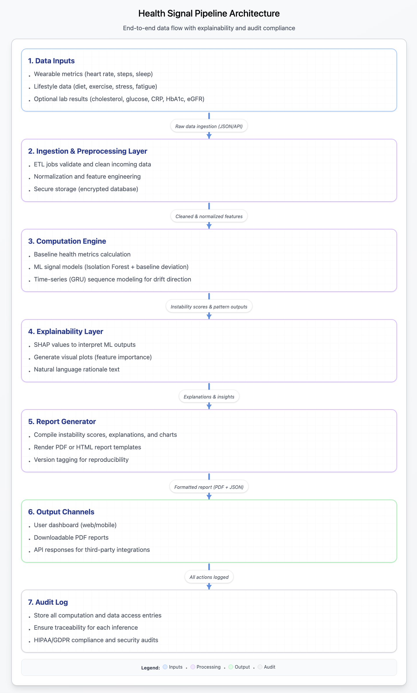

# SubHealthAI: Explainable Preventive Health Intelligence

SubHealthAI is an **AI-powered preventive health project currently in development**.  
Its purpose is to analyze wearable and lifestyle data to **surface research-associated physiological drift patterns** that often go unnoticed in traditional healthcare.  
The goal is not to provide a medical diagnosis, but to **provide individuals with explainable, non-diagnostic pattern summaries for personal awareness** by surfacing patterns that may be worth noticing.
The project is in active research and early validation stages following publication of its technical whitepaper on **Preprints** (DOI [10.20944/preprints202511.0156.v1](https://doi.org/10.20944/preprints202511.0156.v1)) and archival repository version on **Zenodo** (DOI: [10.5281/zenodo.17388335](https://doi.org/10.5281/zenodo.17388335)).

---

### Why this matters
- Chronic diseases account for almost **90% of U.S. healthcare spending** ($4.1 trillion annually).  
- Many chronic conditions may begin with **silent inflammation or early physiological dysfunction** that can remain unnoticed until symptoms emerge, diagnostic thresholds are crossed, or clinical escalation occurs.
- By offering individuals a clearer view of these physiological drift patterns,  
SubHealthAI has the potential to lower long-term costs and improve health outcomes.  
- All development follows a **privacy-first design** and will align with **HIPAA and FDA digital health guidelines** during clinical testing.

---

## 🔍 What SubHealthAI Actually Does
Most wearable apps today provide raw metrics (HR, HRV, steps, sleep) in isolation.
They rarely integrate these into meaningful health patterns or long-term signal insights.

SubHealthAI is different. It provides a **structured pattern-monitoring layer** on top of wearable and lifestyle data:

1. **Cross-signal integration**  
   - Combines multiple inputs (HRV decline, rising resting HR, accumulated sleep debt, activity instability).  
   - Surfaces dysfunction patterns that single-device apps cannot reveal.

2. **Non-diagnostic pattern flags**  
   - Generates explainable pattern flags highlighting physiological drift across sleep, autonomic, and metabolic domains.  
   - Each flag includes supporting rationale and calibration context.

3. **Longitudinal tracking**  
   - Analyzes rolling 7/30/90-day trends instead of one-night snapshots.  
   - Captures slow-moving dysfunctions and reduces false positives.

4. **Multimodal roadmap**  
   - Now (MVP): wearable + lifestyle inputs.  
   - Future: optional patient-provided lab results (e.g., CRP, HbA1c, vitamin D) to increase precision.

5. **Shareable outputs**  
   - Weekly plain-language pattern summaries.  
   - One-tap PDF reports with tables, charts, and attribution — a non-diagnostic summary you can share with a clinician on your own terms.

By sitting between raw wearable data and formal clinical diagnosis, SubHealthAI addresses a critical preventive-health gap: turning fragmented signals into structured, explainable pattern summaries for personal awareness.

---

## 🧩 AI & Explainability Layer (New)

SubHealthAI now includes a **machine learning and explainable AI pipeline** that enhances the preventive insights:

1. **Baseline Model (scikit-learn)**  
   - Detects daily deviations from a user’s personal baseline (HRV, Resting HR, Sleep, Steps).  
   - Uses robust z-score normalization and Isolation Forests to compute a non-diagnostic instability score.  

2. **Sequence Model (PyTorch)**  
   - Learns time-series drift direction (stable → rising → volatile).  
   - Helps characterize short-term drift momentum.  

3. **Explainability (SHAP + Linear Surrogates)**  
   - Generates feature importance visuals showing *why* the system flagged a pattern.  
   - Each explanation translates into plain English on the dashboard via the **“Why this score?”** modal.  
   - Reviewers can easily interpret contributing factors without technical background.

4. **Instability Scores Table (Supabase)**  
   - Stores daily instability outputs with version tracking and full audit logs.  
   - Includes rationale, z-scores, and disclaimers to ensure transparency and compliance.  
   - *Note: the physical table is still named `risk_scores`; the `risk_score` column holds the 0–1 instability fraction.*

---

## 🚀 What We’re Building (MVP)
- **Data ingestion** from wearables, lifestyle tracking, and behavioral inputs  
- **Pattern flags**: rule-based indicators (e.g., sleep debt, HRV suppression, elevated resting HR)  
- **AI-generated weekly note**: plain-language summary of drift patterns  
- **Shareable export**: one-tap PDF report with tables, charts, and references  
- **Audit logging**: system-wide transparency for trust and reliability  

This repository contains the **starter codebase**, database schema, and demo UI for the MVP.

---

## 🩺 User-Friendly Dashboard (Explainable UI)

The new dashboard focuses on **clarity for clinicians, reviewers, and regulators**:

- **Interactive Instability Card:** Displays current instability score with color-coded badge (green, yellow, red).  
- **Sparkline Chart:** Visualizes the instability trend over time.  
- **Explainability Modal (“Why this score?”):**  
  - Lists plain-language reasons (e.g., “Resting Heart Rate higher than baseline — contributes to higher instability”).  
  - Includes AI-generated visual (SHAP plot or fallback bar chart).  
  - Adds a clear, non-diagnostic disclaimer.  

All text is structured for **regulatory readability**, ensuring transparency and comprehension for  
attorneys, clinicians, and adjudicators reviewing preventive AI systems.

---

## 🖼 Architecture


```text
[Wearable APIs]       [Lifestyle Inputs]       [Lab / Imaging Data*]
      │                      │                         │
      └──────────────┬────────┴──────────────┬──────────┘
                     ▼
           Data Ingestion Layer
           (Cron Jobs, ETL, API Sync)
                     │
                     ▼
            Supabase Database
     (users, metrics, flags, instability_scores,
      explainability_images, audit_log)
                     │
                     ▼
        Health Analytics & Flag Engine
      (Rule-based flags + Metric baseline)
                     │
                     ▼
      ML Signal Models (Isolation Forest,
          GRU Sequence Model, SHAP Explainability)
                     │
                     ▼
     AI Layer (LLM Wrapper + Preventive Copilot)
      - Generates Weekly Notes
      - Explains Instability Patterns
      - Conversational Interpretation
                     │
                     ▼
         Reports & Visualization Outputs
      → User Dashboard (Next.js)
      → Shareable PDF Report
      → Audit Log for Transparency
```

This diagram illustrates SubHealthAI’s end-to-end data flow, showing how wearable and lifestyle metrics are ingested, processed, and transformed into explainable, auditable instability summaries.


*End-to-end data flow with explainability and audit compliance.*

---

You can test SubHealthAI locally in 60 seconds:

1. Start the dev server:
   ```bash
   npm run dev
   ```
2. Open http://localhost:3000/ingest
3. Upload the sample file docs/sample.csv
4. Visit http://localhost:3000/dashboard → metrics & charts update.
5. Click Run Daily Cron (Demo) → flags + weekly note generated.
6. Open http://localhost:3000/weekly → weekly summary.
7. Download PDF from http://localhost:3000/api/report 

⚠️ Demo only - no PHI, not a medical device.

---

## 🛠 Tech Stack
**Frontend (App Layer)**  
- Next.js (App Router), React, TypeScript  
- TailwindCSS + shadcn/ui for responsive, research-grade UI
- Instability dashboard with sparkline + “Why this score?” modal (`risk-panel.tsx`, `ExplainModal.tsx`, `RiskSpark.tsx`)  
- API endpoints:  
  - `/api/risk/explain` → human-readable pattern reasoning + disclaimer  
  - `/api/report` → shareable PDF including AI instability summary

**Backend & Database**  
- Supabase (Postgres with Row-Level Security, Auth, Storage)  
- Supabase Edge Functions (Deno/TypeScript) for ingestion and daily rollups  
- Python Worker for analytics and ML pipelines (decoupled from web app)  

**Data Processing & Analytics**  
- Ingestion: wearable APIs, lifestyle logs, CSV imports  
- Baseline deviation analysis (sleep, HR, HRV, steps)  
- Hybrid rules + ML scoring engine (Python):  
  - scikit-learn → anomaly detection, clustering, baseline modeling  
  - PyTorch → time-series sequence modeling and instability scoring

  - **Explainable ML models (Python / Supabase Integration):**
  - `/ml/baseline_model.py` → anomaly detection and personalized baseline instability  
  - `/ml/forecast_model.py` → time-series drift-direction modeling  
  - `/ml/explainability.py` → SHAP visualizations and linear surrogate fallback  
  - Outputs written to `risk_scores` table (auditable, versioned; instability fraction in `risk_score` column)
  

**AI & NLP Integration**  
- LLMs assisted narrative generation for plain-language weekly notes  
- Schema-enforced outputs with disclaimers and rationales stored in audit logs  
- Compliance guardrails: prevent diagnostic claims, enforce structured reporting  

**Reporting & Export**  
- react-pdf / pdf-lib for shareable PDF exports  
- Transactional email delivery (Postmark, SendGrid, Supabase Functions)  

**Security & Compliance**  
- Row-Level Security on all user data  
- Audit logging of all automated actions (`audit_log` table)  
- HIPAA/FDA alignment by design (encryption, disclaimers, transparency)  

---

## 🗂 Database Schema
Key tables in `/supabase/schema.sql`:
- `users` → profiles and auth linkage  
- `events_raw` → ingested wearable + lifestyle data  
- `metrics` → computed metrics (sleep, HR, HRV, steps, etc.)  
- `flags` → rule-based signals indicating physiological drift  
- `risk_scores` → daily instability outputs (`risk_score` column stores 0–1 fraction; table name retained)  
- `weekly_notes` → AI-generated summaries for end users  
- `audit_log` → system-wide transparency and accountability  

---

## Live Research Prototype (Demonstration Only)

A non-diagnostic research MVP of SubHealthAI has been deployed for demonstration and technical evaluation purposes only, supporting controlled demo profiles and audit logging to ensure transparency and reproducibility.

The prototype supports controlled demo profiles and audit logging to ensure transparency and reproducibility.

Demo access: https://subhealthai.vercel.app

---

## 📈 Roadmap

**✅ MVP (Completed)**  
- [x] Project scaffold: Next.js + Supabase + TailwindCSS  
- [x] Core database schema (`users`, `events_raw`, `metrics`, `flags`, `weekly_notes`, `audit_log`)  
- [x] Rule-based flagging engine (Python + TypeScript) with rationale strings  
- [x] CSV ingest + rollup pipeline for reproducible demo data  
- [x] Charts and metrics dashboard (sleep, HRV, steps trends)  
- [x] Cron API route for daily flagging + weekly note generation  
- [x] Shareable PDF export with AI-generated summaries  
- [x] **Baseline & sequence ML models (scikit-learn + PyTorch)**  
- [x] **Explainability layer (SHAP + fallback linear model)**  
- [x] **Instability scoring table + Supabase integration**  
- [x] **Interactive Instability Dashboard (sparkline + “Why this score?” modal)**  
- [x] Nightly GitHub Actions for automated ML cron jobs  

**✅ Phase 2 (Completed)**  
- [x] Integrated instability summaries into weekly PDF with disclaimer block  
- [x] Added Admin “Recompute” endpoint (manual ML re-run via API)  
- [x] Supabase Storage for SHAP/fallback visuals with dashboard display  
- [x] Transactional email delivery (report distribution)  
- [x] Expanded audit logs for ML transparency & compliance  

**🧠 Phase 3 (Next) — Preventive Intelligence Expansion (2025–2026)**  
- [ ] Dynamic SHAP visualization (Apple Health / Samsung Health / WHOOP–style graphs)  
- [ ] Expanded metric set: stress markers, jet-lag indicators, medication logs, circadian rhythm & recovery metrics  
- [ ] Adaptive thresholds and personalized baseline recalibration  
- [ ] NanoChat-style LLM orchestration for contextual summaries  
  - Prefill/decode + KV cache for low-latency inference  
  - Sandboxed Python tool use for in-context computations (instability, drift, explainability)  
- [ ] Lightweight Preventive Copilot: “Why did the instability score change?” and “What improved?” contextual insights  
- [ ] Evaluation harness inspired by ARC/MMLU for accuracy and interpretability benchmarking on health datasets  
- [ ] JSON-based tool contracts, safety guardrails, and transparent router policies  
- [ ] Lightweight SFT for tone and style consistency in summaries  

**🔬 Research & Clinical Roadmap (2026+)**  
- [ ] Wearable API integrations (Fitbit, Oura, Garmin, Apple Health, WHOOP)  
- [ ] Personalized baseline deviation engine (adaptive thresholds per user)  
- [ ] Multimodal signal scoring with lab + lifestyle data (CRP, HbA1c, Vitamin D)  
- [ ] Embedding models for cross-signal correlation (HRV ↔ sleep debt ↔ recovery lag)  
- [ ] HL7 FHIR integration for clinician/EHR interoperability  
- [ ] Pilot testing with clinical advisors under HIPAA/FDA digital health alignment  
- [ ] Provisional patent filed: **“System and Method for Explainable AI Detection of Subclinical Physiological Dysfunction”** (USPTO, 2025)  
- [ ] Long-term goal: pursue FDA-aligned validation studies and eventual SaMD pathways after proper regulatory approvals.

---

## 🔮 Future Integrations

SubHealthAI is designed to **extend, not compete with, wearable platforms**.  
Our value is in **cross-signal integration, explainable pattern flags, and compliance guardrails**.

Planned integrations include:
- **Wearables**: Fitbit, Oura, Apple Health, WHOOP  
- **Lab inputs**: CRP, HbA1c, Vitamin D (optional patient-provided)  
- **EHR interoperability**: HL7 FHIR APIs for clinical pilots  
- **ML models**: anomaly detection, embeddings, multimodal signal monitoring

---

## 📄 Research Publication

[](https://doi.org/10.5281/zenodo.17388335)
[](https://doi.org/10.20944/preprints202511.0156.v1)
[](https://osf.io/gpce8/)

The SubHealthAI research foundation has been published across multiple open-access repositories for transparency and peer validation:

### 🧠 **Primary Canonical Version**
**SubHealthAI: Predictive and Explainable AI for Early Detection of Subclinical Health Decline**  
📘 DOI: [10.20944/preprints202511.0156.v1](https://doi.org/10.20944/preprints202511.0156.v1)  
🗓 Submitted October 29 2025 · Public November 2025  
*(v2 with updated non-diagnostic framing in preparation)*

This is the official open-access preprint describing SubHealthAI’s preventive-intelligence system:
- Wearable + multimodal ingestion pipeline  
- Baseline deviation and drift-direction modeling (Isolation Forest + GRU)  
- SHAP-based explainability and empirical metrics  
- Non-diagnostic framework under FDA SaMD alignment  

---

### 🔬 **Supporting Mirrors**
- **Zenodo DOI:** [10.5281/zenodo.17388335](https://doi.org/10.5281/zenodo.17388335) — permanent archival copy for citation integrity and reproducibility.  
- **OSF Project:** [https://osf.io/gpce8](https://osf.io/gpce8/) — hosts supplementary datasets, schema snapshots, and evaluation logs (MetaArXiv moderation pending).  

A peer-reviewed **IEEE submission** expanding clinical validation and multimodal integration is in preparation.

---

## 🧾 Intellectual Property Notice
A U.S. Provisional Patent titled **“System and Method for Explainable AI Detection of Subclinical Physiological Dysfunction”** has been filed with the USPTO (2025).  
This establishes the intellectual property foundation for SubHealthAI’s explainable AI and instability-monitoring framework.
  
---

## 🤝 How to Contribute
We welcome collaborators in:  
- Preventive medicine, public health, and clinical research  
- AI/ML modeling (time-series, embeddings, anomaly detection)  
- Full-stack engineering (Next.js, Supabase, data pipelines)  

---

## 📬 Contact
- Founder: **Mohd Shaarif Khan**  
- Email: **shaarifkhan12@gmail.com**
- Google Scholar: [https://scholar.google.com/citations?user=CDV0JHIAAAAJ](https://scholar.google.com/citations?user=CDV0JHIAAAAJ)  
- ORCID: [0009-0002-1219-2129](https://orcid.org/0009-0002-1219-2129)  
- GitHub: [https://github.com/mohdshaarifkhan](https://github.com/mohdshaarifkhan)  
- LinkedIn: [www.linkedin.com/in/mohdshaarif-khan](https://www.linkedin.com/in/mohdshaarif-khan)

---

> ⚠️ **Disclaimer**: SubHealthAI is a research and development project.  
> It is **not a medical device** and does not provide medical advice.  
> All future development will follow **HIPAA-compliant, privacy-first design**  
> and align with FDA digital health guidelines.  
> Always consult qualified healthcare professionals for medical decisions.
